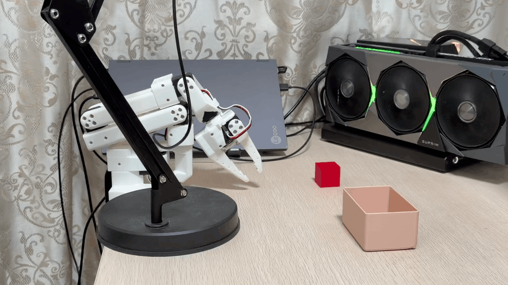
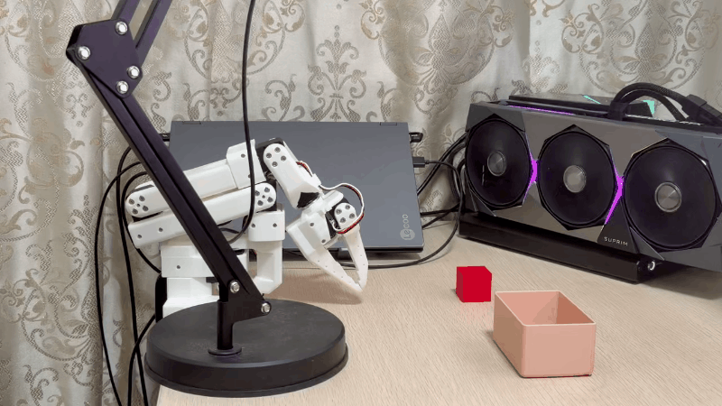
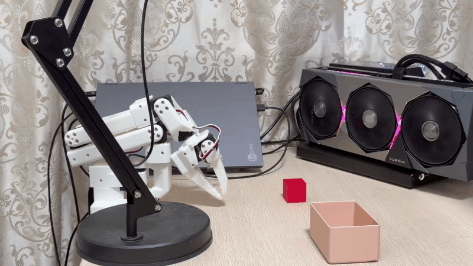

# LeRobot SO-101 Policy Evaluation

> 机械臂算法比较 — Benchmarking state-of-the-art imitation learning & Vision-Language-Action policies on the SO-101 robotic arm for real-world manipulation tasks.

<p align="center">
  
</p>

---

## 🤖 Can the Robot Learn to Pick & Place?

**Task:** Grasp the red block and drop it into the box.

The SO-101 follower arm is controlled entirely by a neural policy — no hard-coded motion planning, no traditional inverse kinematics tricks. Everything you see below is pure *learning-from-demonstration* running on real hardware.

Four state-of-the-art policies, one identical dataset, one identical robot.
Which one actually **closes the sim-to-real gap**?

---

## 🎬 Real-World Rollouts

<table>
  <tr>
    <th align="center" width="25%"><b>ACT</b> — Action Chunking Transformer</th>
    <th align="center" width="25%"><b>PI0</b> — VLA Foundation Model</th>
    <th align="center" width="25%"><b>Diffusion Policy</b> — Denoising Diffusion</th>
    <th align="center" width="25%"><b>Multi-Task DiT</b> — Flow-Matching DiT</th>
  </tr>
  <tr>
    <td align="center"></td>
    <td align="center"></td>
    <td align="center"></td>
    <td align="center"></td>
  </tr>
</table>

---

## 🏆 Current Benchmark Status

> 📍 **The bar:** reach → grasp → lift → transport → release into the box.

| Policy | Paradigm | Reaches Target | Grasps Block | Lifts & Moves | Drops into Box |
| :--- | :--- | :---: | :---: | :---: | :---: |
| **ACT** | CVAE + Transformer (from scratch) | ✅ | ✅ | ✅ | ❌ |
| **PI0** | VLA (fine-tuned last 4 layers) | ⚠️ | ❌ | — | — |
| **Diffusion Policy** | Denoising Diffusion (from scratch) | ⚠️ | ❌ | — | — |
| **Multi-Task DiT** | Flow-Matching DiT (from scratch) | ⚠️ | ❌ | — | — |

**Key takeaway so far:** Only **ACT** reliably closes the gripper around the red block.
All other policies can roughly navigate to the workspace but struggle with the precise millimetre-level alignment needed for a firm grasp — suggesting that *action chunking with temporal consistency* (ACT's signature) is disproportionately valuable for this low-data regime on the SO-101 arm.

> ⚠️ These are **intermediate results**. Experiments continue — release mechanism tuning, longer training runs, and data augmentation are tracked in the Issues section.

---

## 📚 How Was It Trained? The Dataset

All four policies are trained on **exactly the same demonstrations** so the comparison is fair:

- **Collection method:** Kinesthetic teaching — the SO-101 *leader* arm is manually guided, and the *follower* arm records every joint state, gripper position, and camera frame in sync.
- **Episodes:** 50 full pick-and-place demonstrations (grasp the red block → lift → carry → drop into the target box).
- **Sensors:** 2× RGB cameras (front view + side/wrist view) + 6-DoF joint states + binary gripper state.
- **Format:** [LeRobotDataset v3](https://huggingface.co/docs/lerobot/lerobot-dataset-v3) — compatible with every policy out of the box.
- **Dataset ID:** `WT/test`

The exact same 50 episodes are fed to every training script in [`examples/tutorial/`](examples/tutorial/). The only variables that change are the **architecture** and the **training recipe** (see below).

---

## 🧠 Four Architectures, Four Philosophies

Each policy represents a different paradigm in robot learning — from classical transformer-based imitation learning to billion-parameter VLA foundation models.

---

### ① ACT — Action Chunking Transformer

ACT replaces the standard single-step regressor with a **Conditional VAE + Transformer** that emits a short *sequence* of future actions (action chunking). This dramatically smooths out jitter and mitigates compounding error — exactly the property that lets it succeed at grasping where the others miss.

<p align="center">
  
</p>

<p align="center">
  
  <br><sub><i>Real rollout — ACT reaches, grasps, lifts, but cannot yet release into the box.</i></sub>
</p>

#### 🔁 Training Pipeline

1. **Input:** Dataset metadata is read (`WT/test`, 50 episodes) and feature types are mapped via `dataset_to_policy_features` — every non-action feature becomes an `input_feature`, every action feature becomes an `output_feature`.
2. **Policy instantiation:** A fresh `ACTPolicy` is built from `ACTConfig`. No pretrained weights are used — the CVAE encoder, the Transformer decoder, and the vision backbones are all randomly initialized.
3. **Pre/post processors:** `make_pre_post_processors` is called with `dataset_stats=dataset_metadata.stats` so MEAN_STD normalization statistics for the 6-DoF joints, the gripper, and the camera pixels are baked straight into the processors (and saved alongside the checkpoint for inference).
4. **Delta-timestamps alignment:** ACT requires temporal alignment between the *observation window* and the *action chunk*. `observation_delta_indices` (default `[0]`) and `action_delta_indices` (the full chunk length, typically 100 future steps indexed in seconds through `make_delta_timestamps`) are computed from `dataset_metadata.fps` and attached to both state and image features when constructing `LeRobotDataset`.
5. **Optimizer & DataLoader:** Default AdamW preset from ACTConfig, batch size 8, DataLoader runs with `num_workers=0` (Windows-safe) and `shuffle=True` with `drop_last=True` for stable batch-norm behaviour.
6. **Outer training loop:** A `while`-loop wraps the DataLoader so training continues past the end of a single epoch. Every batch is sent through `preprocessor` (normalization + padding), then `policy.forward(batch)` returns the CVAE ELBO loss, which is backpropagated end-to-end.
7. **Schedule:** 100 000 steps total. Checkpoints of `policy` + `preprocessor` + `postprocessor` are `save_pretrained`'d every 10 000 steps to `outputs/robot_learning_tutorial/act_so101`.

#### 🔮 Inference Pipeline

1. **Load checkpoint:** `ACTPolicy.from_pretrained(...)` reads the serialized ACT config and weights from the output directory above; the model is moved to CUDA and switched to `.eval()` mode.
2. **Camera warm-up / reset:** Before any robot connect, `lerobot-find-cameras opencv` is invoked in an isolated temporary directory with `--record-time 1.5 --fps 15` so the USB 2.0 bus re-enumerates both cameras cleanly (this avoids the well-known "can't grab frame" bug after a previous disconnection).
3. **Build processors (again):** Critically, `make_pre_post_processors` is rebuilt with the exact same `dataset_metadata.stats` used during training — this guarantees the normalization mean/std on the real joint streams match the training distribution.
4. **Robot & cameras:** `SO101FollowerConfig` declares two `OpenCVCamera`s: `side` on index `0` and `front` on index `2`, both 640×480 @ 15 FPS with DSHOW backend. The follower on COM9 is connected with `calibrate=False` to avoid blocking on interactive input.
5. **Per-step loop (800 steps max):**
   - `robot.get_observation()` returns fresh joint states + gripper state + the latest two RGB frames.
   - `build_inference_frame(observation, ds_features=..., device=...)` reshapes the raw robot dict into the exact tensor layout expected by the dataset / policy.
   - `obs_processed = preprocess(obs_frame)` applies normalization and dtype casting.
   - `model.select_action(obs_processed)` — torch.no_grad — samples a full action chunk from the CVAE decoder and then returns only the next action.
   - `postprocess(action)` denormalizes back to joint angles and gripper positions.
   - `make_robot_action(action, dataset_metadata.features)` unpacks the flat tensor back into a dict keyed by `action` / `gripper_xy...`, then `robot.send_action(...)` dispatches the CAN packets.

---

### ② PI0 — Vision-Language-Action Foundation Model

PI0 is built on **PaliGemma** (≈3 B params, flow-matching action head). Instead of training from scratch, we **freeze the entire vision-language backbone** and only fine-tune the **last 4 transformer layers + lm_head + final norm** — a classic parameter-efficient transfer-learning recipe for VLA models.

<p align="center">
  
</p>

<p align="center">
  
  <br><sub><i>Real rollout — PI0 approaches the workspace but misses the final millimetre-level alignment for grasping.</i></sub>
</p>

#### 🔁 Training Pipeline (PI0-Fast recipe)

1. **Offline mode:** Training starts with `HF_HUB_OFFLINE=1` and `TRANSFORMERS_OFFLINE=1` so the pretrained `lerobot/pi0fast-base` checkpoint is loaded strictly from the local Hugging Face cache — no runtime network dependency on the lab machine.
2. **Load dataset metadata:** Same `WT/test` dataset; `dataset_to_policy_features` splits features into input/output sets and feeds them into `PI0FastConfig`.
3. **Config highlights:** The recipe locks the model to `dtype="bfloat16"` (mixed precision), enables `gradient_checkpointing=True` (otherwise the 3B-parameter model OOMs on a 20 GB card), sets `chunk_size=10` and `n_action_steps=10` (PI0-Fast predicts action chunks of 10 and executes them sequentially with KV-cache-based roll-forward), and sets up an optimizer/lr-scheduler at `2.5e-5` with 500-step warmup and a 20 000-step linear decay down to `2.5e-6`. Gradient clipping at norm 1.0 is used because mixed-precision fine-tuning can produce very large spike gradients when KV-cache patterns shift.
4. **Load pretrained weights:** `PI0FastPolicy.from_pretrained("lerobot/pi0fast-base", config=cfg)` swaps the frozen PaliGemma vision encoder + language model in, then the script *manually* iterates over all named parameters and flips `requires_grad=False` on everything.
5. **Selective unfreezing:** The layer numbers are parsed from every parameter name containing `language_model.layers.` to find `max_layer`. The final 4 layers (`{max_layer-3 ... max_layer}`) plus every `lm_head` tensor and both `model.norm` / `language_model.norm` weights get `requires_grad=True` again. Out of ~3 B total parameters only ~0.4 B are actually trained — which is exactly the budget that fits in 20 GB VRAM with bf16 + gradient checkpointing.
6. **Pre/post processors + delta-timestamps:** `make_pre_post_processors(cfg, dataset_stats=dataset_metadata.stats)` uses MEAN_STD for states/actions and `IDENTITY` for pixel features (PaliGemma's own SigLIP vision tower already has a built-in preprocessing head). Delta timestamps are generated only for `action` with the full `action_delta_indices` list; observation-state and every image feature use `[0]` since PI0 consumes a single frame snapshot.
7. **DataLoader + mixed-precision loop:** batch size 1, `while`-wrapped DataLoader, and every forward pass is wrapped in `torch.amp.autocast(device_type="cuda", dtype=torch.bfloat16)`. The `task` field inside every batch is cleaned so empty language labels default to `"pick up the block"`. Loss is a flow-matching MSE over the 10-token action prefix; `clip_grad_norm_` is applied to the trainable parameter list before the optimizer step, and the cosine-with-warmup scheduler is stepped every iteration.
8. **Checkpoints:** Trainable weights + config + processors are serialized to `outputs/robot_learning_tutorial/pi0fast_so101` every 5 000 steps for a total of 20 000 steps.

#### 🔮 Inference Pipeline

1. **Offline guardrails:** Same `HF_HUB_OFFLINE=1 / TRANSFORMERS_OFFLINE=1` env vars as training, so the fine-tuned variant loads without falling back to the Hub.
2. **Model path resolution:** Because PI0's fine-tuning job can produce multiple output layout variants (single final dir vs. checkpoints/020000/pretrained_model vs. LoRA variants), the script tries three candidate model paths in order and raises a clear error listing every attempted path if `config.json` was not produced.
3. **Camera reset:** Same `lerobot-find-cameras` reset routine — 1.5 s, 15 FPS, isolated temp dir.
4. **Processors rebuilt with dataset stats:** Same as ACT, the inference-side processors are reconstructed on top of `dataset_metadata.stats` rather than the serialized pretrained-model stats, otherwise the joint ranges used during fine-tuning don't match and the follower arm produces jerky, off-scale motions.
5. **Robot + cameras + task token:** Follower on COM10, `side=0 / front=2` cameras at 15 FPS MJPG, `calibrate=False` on connect.
6. **Per-episode preparation:** `model.reset()` must be called at the start of every episode because PI0 uses **KV-caching during autoregressive action rollout** (`use_kv_cache=True` in the config) — without this reset the cached prefix keys leak across rollouts and the policy produces garbage for the first several hundred steps.
7. **Per-step loop (500 steps max):**
   - `robot.get_observation()` — joint state + gripper + two images.
   - `build_inference_frame(observation, ds_features, device, task=TASK_DESCRIPTION, robot_type="so101_follower")` — crucially, the **language task token and robot_type token are kwargs to this helper, not hand-assembled into the frame dict**, which is how PaliGemma's shared prefix/suffix cross-attention pattern sees them correctly inside the token stream.
   - `preprocess(obs_frame)` — pixel IDENTITY pass-through, MEAN_STD on state tensors, language task token is tokenized and padded using PI0's tokenizer from the PaliGemma weights.
   - `model.select_action(...)` in torch.no_grad runs 10 steps of flow-matching decoding inside the suffix stream, and PI0 returns only the next action while advancing the KV cache.
   - `postprocess` denormalizes, `make_robot_action` converts to the SO-101 CAN dict, `robot.send_action` sends it.

---

### ③ Diffusion Policy — Denoising Diffusion for Action Generation

> **"Model the distribution, not the mean — because there's more than one way to grasp a block."**

Diffusion Policy frames action generation as a **denoising diffusion** process over a 64-step action horizon. By gradually removing noise, it naturally captures *multi-modal* action distributions — a property that should help in ambiguous manipulation scenarios. Quantile normalization is used for states/actions to be robust to outlier kinesthetic demonstrations.

<p align="center">
  
</p>

<p align="center">
  
  <br><sub><i>Real rollout — Diffusion Policy explores the workspace but fails to close the gripper on the block.</i></sub>
</p>

#### 🔁 Training Pipeline

1. **Dataset metadata:** Same `WT/test` / 50 episodes as every other policy. Features are split with `dataset_to_policy_features` into input & output features for `DiffusionConfig`.
2. **In-memory quantile statistics (critical!):** Unlike ACT and PI0, Diffusion Policy uses **QUANTILES normalization** for state & action features, which requires quantile keys `q01, q10, q50, q90, q99` in the stats dict. The default LeRobotDataset metadata *doesn't* automatically compute these for arbitrary local datasets, so the script computes them **in memory** — it instantiates a plain `LeRobotDataset` (no delta timestamps), iterates over every frame, stacks `observation.state` and `action` tensors, and calls `get_feature_stats(..., quantile_list=DEFAULT_QUANTILES)` per feature.
3. **Merge quantiles into stats:** `merge_quantile_into_stats` performs a `deepcopy` of `dataset_metadata.stats` and injects the per-feature quantile arrays, so the original dataset files on disk are **never mutated** (important for reproducibility). The merged `augmented_stats` is what gets passed to `make_pre_post_processors`, and also what gets persisted into the output checkpoint.
4. **DiffusionConfig architecture:**
   - Normalization mapping: VISUAL → MEAN_STD (pretrained ResNet image net), STATE → QUANTILES, ACTION → QUANTILES.
   - Observation window `n_obs_steps=2` (previous timestep + current), prediction `horizon=64`, execution slice `n_action_steps=32` (execute half the predicted horizon then re-plan — classic Diffusion Policy recipe).
   - Vision backbone defaults to ResNet18, small and fast.
5. **Delta timestamps:** For each of `observation.state`, `action`, and every image feature, the corresponding config `*_delta_indices` lists are expanded via `make_delta_timestamps(fps)`. For action this spans 64 future indices; for observation and images it spans `[-1, 0]` for the two-frame context.
6. **Optimizer + LR scheduler:** Batch size 12, standard DiffusionPolicy optimizer preset. A cosine-annealing LR scheduler with 500 warmup steps is critical for stable diffusion loss — without warmup the early gradient variance explodes and the denoiser never converges.
7. **Outer loop (100 k steps):** `while`-wrapped DataLoader, each batch goes through the quantile-aware preprocessor before `policy.forward(batch)` returns the standard diffusion training loss (predict noise / predict x0 depending on schedule variant). Per-step LR is logged every 100 steps so warmup and annealing shape can be validated. Checkpoints every 10 000 steps serialize the policy *and* both processors — the processors' stats JSON files inside the output directory will contain the quantile keys for downstream inference.

#### 🔮 Inference Pipeline

1. **Load model:** `DiffusionPolicy.from_pretrained(outputs/robot_learning_tutorial/diffusion_so101)` → CUDA → `.eval()`.
2. **Camera reset:** Same 1.5 s / 15 FPS USB re-enumeration.
3. **Rebuild processors with the same dataset metadata stats:** Critically, **the inference script must still point `make_pre_post_processors` at `dataset_metadata.stats` and use the same quantile merge logic that training used**. Otherwise state and action tensors are clipped to the wrong q01/q99 range and joints saturate.
4. **Action statistics verification (debug):** As a sanity check, the script iterates over `dataset_metadata.features["action"]["names"]` and prints per-joint mean/std/min/max from the stats dict. This catches mis-specified dataset roots before the robot ever moves.
5. **Robot / cameras:** SO-101 follower on COM9, side camera = 0, front camera = 2, 640×480 MJPG @ 15 FPS, `calibrate=False`.
6. **Per-step loop (800 steps max):**
   - First 3 steps: the script peeks at `obs["state"]` against the dataset's `observation.state` names so any index-swap between SO-101 joints and the dataset feature order is visible in debug output.
   - `build_inference_frame(observation, ds_features, device)` produces the standardised frame dict.
   - `preprocess` applies MEAN_STD to the two RGB frames, and quantile clipping → [-1, 1] scaling to state tensors.
   - `model.select_action(obs_processed)` runs the full diffusion sampling chain (typically DDIM with ~20 denoising steps) to produce a 64-step action trajectory. The policy's internal `n_action_steps=32` slice is returned so the returned action is the next 32-step prefix.
   - `postprocess` inverts quantile normalization back to joint angles, `make_robot_action` converts to dict, `robot.send_action` dispatches.

---

### ④ Multi-Task DiT — Flow-Matching Diffusion Transformer

Multi-Task DiT is a **flow-matching Diffusion Transformer** that takes both visual tokens (CLIP ViT-B/16) and text tokens (CLIP text encoder) as conditioning. Designed for multi-task transfer across language instructions, it predicts a 32-step action trajectory in a single forward pass of a 6-layer, 512-dim DiT.

<p align="center">
  
</p>

<p align="center">
  
  <br><sub><i>Real rollout — Multi-Task DiT reaches towards the scene but doesn't align the gripper well enough to close it.</i></sub>
</p>

#### 🔁 Training Pipeline

1. **Dataset metadata:** Same `WT/test` 50-episode dataset; features split via `dataset_to_policy_features`.
2. **MultiTaskDiTConfig architecture:**
   - Objective switched to `objective="flow_matching"` (more stable training and better sample quality than vanilla diffusion for DiTs).
   - Temporal settings: `n_obs_steps=2` (2-frame observation context), `horizon=32` (predict 32 action steps), `n_action_steps=24` (execute 24 / re-plan every 24).
   - DiT backbone: 6 Transformer layers, 512 hidden dim, 8 attention heads, 0.1 dropout.
   - Encoders: both vision **and** text use `openai/clip-vit-base-patch16` (~600 MB each, auto-downloaded on first run). Images are first resized to `(256, 256)` then *random-cropped* to `(224, 224)` during training for data augmentation — at inference the crop is centred.
   - Optimizer: AdamW `lr=2e-5`, betas `(0.95, 0.999)`, weight decay off. A separate `vision_encoder_lr_multiplier=0.1` is applied inside `model.get_optim_params()` so the pretrained CLIP vision encoder moves *slower* than the DiT head — this is important because otherwise the fine-tuning signal degrades CLIP's visual representation early.
   - LR schedule: cosine with 500 warmup steps.
3. **Policy instantiation:** `MultiTaskDiTPolicy(cfg)` is created from scratch with CLIP encoders loaded pretrained, then transferred to CUDA and switched to `.train()`.
4. **Processors & delta-timestamps:** `make_pre_post_processors(cfg, dataset_stats=dataset_metadata.stats)` applies MEAN_STD to states/actions and the CLIP-standard MEAN_STD transform to 224×224 pixel crops. Delta-timestamps: action spans the 32-element `action_delta_indices` list; state and all image features span `observation_delta_indices = [-1, 0]` corresponding to `n_obs_steps=2`.
5. **DataLoader:** Batch size 8, `pin_memory=True`, `num_workers=0`, `shuffle=True`.
6. **Outer training loop (20 k steps):**
   - Language task tokens: the batch's `"task"` field is cleaned so any empty string falls back to `"pick up the block"`.
   - Preprocessor packs the CLIP-standard pixel transform (resize + random crop + normalize) + MEAN_STD on states + CLIP tokenizer on the task string.
   - `model.forward(batch)` runs the DiT once per flow-matching training step: noise is injected at a random timestep, the DiT regresses the velocity field (`v_t = x_1 - x_0`), and the loss is a weighted MSE against the ground-truth flow.
   - Gradient clipping (norm 1.0) is applied manually because MultiTaskDiTConfig does not expose an `optimizer_grad_clip_norm` parameter.
   - Checkpoints every 5 000 steps go to `outputs/robot_learning_tutorial/multi_task_dit_so101`.

#### 🔮 Inference Pipeline

1. **Model load:** `MultiTaskDiTPolicy.from_pretrained(...)` → CUDA → `.eval()`.
2. **Camera reset:** Standard 1.5 s / 15 FPS USB re-enumeration routine.
3. **Processors rebuilt with dataset stats:** Ensures pixel means/stds and the MEAN_STD scaling on states are identical to training.
4. **Robot / cameras:** Follower on COM9, `side=0 / front=2`, 640×480 MJPG @ 15 FPS, `calibrate=False`.
5. **Per-episode reset:** `model.reset()` clears the flow-matching sampler's internal state (needed if sampling ever diverges from its ODE cache across episodes).
6. **Per-step loop (800 steps max):**
   - First 3 steps: peek at raw states against dataset feature names as a sanity check for axis swap.
   - `build_inference_frame(observation, ds_features, device, task=LANGUAGE_TASK, robot_type="so101_follower")` — just like PI0, Multi-Task DiT expects both the language instruction `"pick up the block"` and a `robot_type` token to be injected through the kwarg path (rather than poked into `obs_frame` manually), otherwise the text and robot-type embeddings land in the wrong sequence positions and conditioning silently breaks.
   - `preprocess` applies CLIP-standard center-crop → MEAN_STD on frames, MEAN_STD on states, CLIP tokenization on the task.
   - `model.select_action(obs_processed)` runs the flow-matching ODE sampler for the configured number of steps on the 32-step horizon, then slices off 24 steps for execution; only the next single action is returned per step.
   - `postprocess` inverts state/action normalization, `make_robot_action` converts to dict, `robot.send_action` sends the CAN command.

---

## 🧾 Training Recipe Cheat-Sheet

| Policy | Params approx. | Init | Trainable scope | Steps | Batch | Notes |
| :--- | :---: | :--- | :--- | :---: | :---: | :--- |
| ACT | ~50 M | Scratch | Full model | 100 k | 8 | CVAE + action chunking |
| PI0 | ~3 B (0.4 B trainable) | `lerobot/pi0fast-base` | Last 4 LM layers + head + norm | 20 k | 1 | bf16 + grad ckpt, VLM frozen |
| Diffusion Policy | ~70 M | Scratch | Full model | 100 k | 12 | Quantile norm, cosine schedule |
| Multi-Task DiT | ~230 M | Scratch + CLIP pretrained | Full DiT + 0.1× LR on CLIP | 20 k | 8 | Flow matching, lang-conditioned DiT |

---

## 📁 Project Layout

```
lerobot/
├── examples/tutorial/
│   ├── act/
│   │   ├── act_training_example_so101.py      # Train ACT (from scratch, 100k steps)
│   │   └── act_using_example_so101.py         # Real-robot inference for ACT
│   ├── pi0_fast/
│   │   ├── pi0_fast_training_example_so101.py # Fine-tune PI0 (last 4 layers, 20k steps)
│   │   └── pi0_fast_using_example_so101.py    # Real-robot inference for PI0
│   ├── diffusion/
│   │   ├── diffusion_training_example_so101.py  # Train Diffusion Policy (quantile norm)
│   │   └── diffusion_using_example_so101.py     # Real-robot inference for Diffusion Policy
│   └── multi_task_dit/
│       ├── multi_task_dit_training_example_so101.py  # Train Multi-Task DiT (flow-matching)
│       └── multi_task_dit_using_example_so101.py     # Real-robot inference for Multi-Task DiT
├── src/lerobot/              # LeRobot library source (policies, datasets, robots, …)
├── tests/                    # Test suite
├── docker/                   # Dockerfiles for benchmarks
├── media/                    # Recorded rollout GIFs & architecture diagrams
├── data/                     # Collected datasets (gitignored)
├── outputs/                  # Training checkpoints (gitignored)
└── configs/                  # SO-101 user configs (train / eval / record)
```

---

## 🔮 Next Steps

Work in progress — tracked on this repo:

- [ ] Tune the gripper **release** timing on ACT (it grasps, now it needs to *let go*).
- [ ] Add **data augmentation** (color jitter, random crop) to Diffusion & DiT to improve grasp alignment.
- [ ] Train PI0 beyond 20 k steps & compare to PI0.5 full-expert fine-tune.
- [ ] Quantify success rates with ≥ 20 rollouts per policy (instead of qualitative pass/fail).
- [ ] Upload the full 50-episode dataset & fine-tuned checkpoints to Hugging Face Hub.

---

## 📚 References

- [LeRobot](https://github.com/huggingface/lerobot) — upstream robotics library by Hugging Face
- PI0 — [PI0/PI0-Fast docs](https://huggingface.co/docs/lerobot/pi0fast)
- ACT — *"Learning Fine-Grained Bimanual Manipulation with Low-Cost Hardware"* ([Zhao et al., RSS 2023](https://arxiv.org/abs/2304.13705)) — first author **Tony Z. Zhao** (ALOHA + ACT)
- Diffusion Policy — *"Diffusion Policy: Visuomotor Policy Learning via Action Diffusion"* ([Chi et al., RSS 2023](https://arxiv.org/abs/2303.04137))
- Multi-Task DiT — *"A Careful Examination of Large Behavior Models for Multitask Dexterous Manipulation"* ([TRI LBM Team, Science Robotics 2026](https://arxiv.org/abs/2507.05331)) — LBM-1, the flow-matching DiT + CLIP conditioning architecture that LeRobot's MultiTaskDiTPolicy is based on
- [SO-101 hardware guide](https://huggingface.co/docs/lerobot/so101)
- [LeRobotDataset format (v3)](https://huggingface.co/docs/lerobot/lerobot-dataset-v3)

---

## License

Apache License 2.0 — inherited from the upstream [LeRobot](https://github.com/huggingface/lerobot) project.
