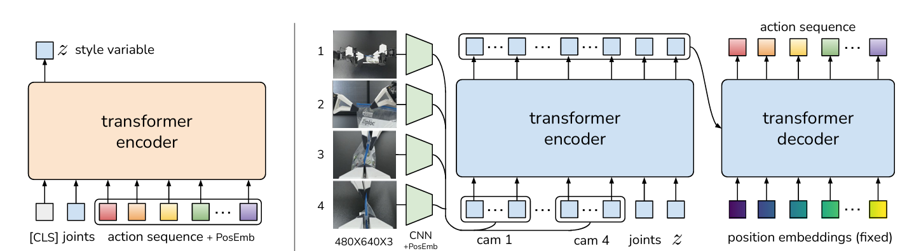
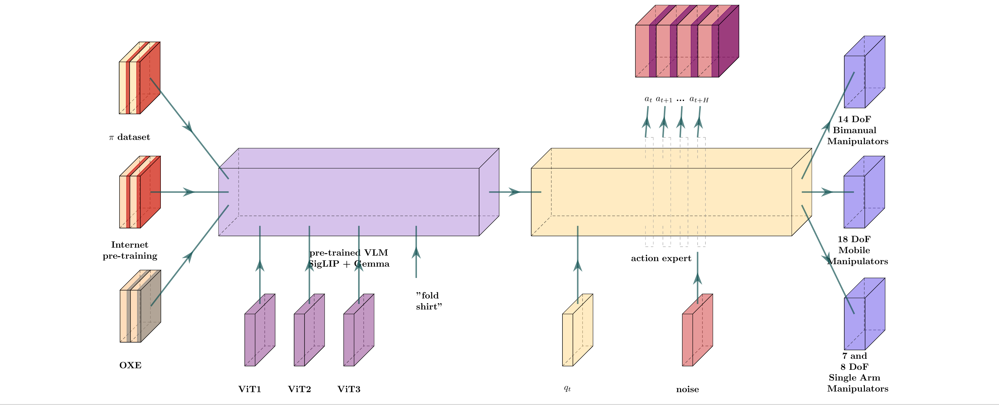
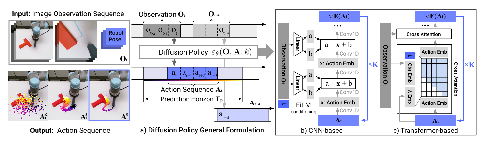
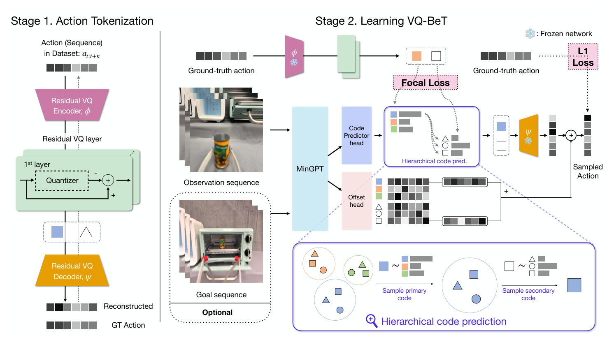

# LeRobot SO-101 Policy Evaluation

> A practical evaluation and benchmarking of state-of-the-art imitation learning and Vision-Language-Action (VLA) policies on the SO-101 robotic arm for real-world manipulation tasks.

<p align="center">
  
</p>

## Project Overview

This project evaluates and compares multiple robot learning policies on the **SO-101 robotic arm** platform, built on top of the [LeRobot](https://github.com/huggingface/lerobot) library by Hugging Face.

The goal is to empirically compare policies such as **PI0**, **PI0-Fast**, **VQ-BeT**, **ACT**, and **Diffusion Policy** in terms of:

- Zero-shot inference performance (without fine-tuning)
- Fine-tuning convergence speed and final performance
- Robustness to SO-101's specific kinematic configuration

## Algorithm Research

This project investigates four representative imitation learning policies, spanning different architectural paradigms — from CVAE-based action chunking to diffusion-based generation and Vision-Language-Action foundation models.

| Policy | Paradigm | Key Idea |
|---|---|---|
| **ACT** | CVAE + Transformer | Action chunking for temporal consistency |
| **PI0** | VLA Foundation Model | Flow matching with shared attention |
| **Diffusion Policy** | Denoising Diffusion | Multi-modal action generation |
| **VQ-BeT** | Vector Quantization + Transformer | Discrete action tokens via VQ-VAE |

Each algorithm is evaluated on the **SO-101 robotic arm** through a unified three-stage pipeline: zero-shot inference → dataset fine-tuning → post-fine-tuning evaluation. Below are the architecture analyses for each policy.

<p align="center">
  
</p>

---

### ACT — Action Chunking Transformer

ACT employs a Conditional Variational Autoencoder (CVAE) with a Transformer backbone. Its core innovation is **action chunking** — predicting multi-step action sequences rather than single steps, which improves temporal consistency and mitigates compounding errors in manipulation tasks.

<p align="center">
  
</p>

---

### PI0 — Vision-Language-Action Model

PI0 is a VLA foundation model built on PaliGemma (~3 B parameters). It adopts **flow matching** for action generation, with a shared transformer that processes visual-language context (prefix stream) and action prediction (suffix stream) through cross-attention, enabling language-conditioned manipulation.


<p align="center">
  
</p>

---

### Diffusion Policy

Diffusion Policy formulates action generation as a **denoising diffusion** process. By learning to reverse a noise-injection procedure, it naturally captures multi-modal action distributions — critical for tasks where multiple valid solutions exist. It supports both state-space and action-space variants.

<p align="center">
  
</p>

---

### VQ-BeT — Vector-Quantized Behavior Transformer

VQ-BeT combines **vector quantization** with a Transformer architecture. Actions are discretized into codebook tokens via a VQ-VAE, enabling the model to represent multi-modal action distributions while retaining the sequence modeling strength of Transformers.

<p align="center">
  
</p>

## Project Structure

```
lerobot/
├── examples/
│   └── tutorial/              # Custom experiment scripts (per-policy)
│       ├── pi0/               # PI0 zero-shot / training / inference
│       ├── pi0_fast/          # PI0-Fast zero-shot / training / inference
│       ├── vqbet/             # VQ-BeT experiments
│       ├── act/               # ACT experiments
│       ├── diffusion/         # Diffusion Policy experiments
│       ├── smolvla/           # SmolVLA experiments
│       ├── async-inf/         # Async inference experiments
│       └── rl/                # Reinforcement learning experiments
├── src/lerobot/               # LeRobot library source (policies, datasets, ...)
├── tests/                     # Test suite (artifacts excluded)
├── docs/                      # Documentation source
├── docker/                    # Dockerfiles for benchmarks
├── papers/                    # Reference papers (ACT, Diffusion, VQ-BeT)
├── media/                     # README images/videos (LeRobot + SO-101)
│   ├── readme/                # Official LeRobot media assets
│   └── so101/                 # Your SO-101 photos/videos (add here)
├── data/                      # Collected datasets (gitignored)
├── outputs/                   # Training outputs / checkpoints (gitignored)
├── configs/                   # SO-101 user configs (train / eval / record)
├── *.yaml                     # Tool configs (pre-commit)
└── pyproject.toml             # Project metadata and dependencies
```

## Quick Start

### Installation

```bash
git clone https://github.com/Yangjingyuan-HK/lerobot-so101-policy-evaluation.git
cd lerobot-so101-policy-evaluation
uv sync --locked --extra all
```

### SO-101 Hardware Setup

Calibrate the SO-101 arm (master + slave) following the [SO-101 hardware guide](https://huggingface.co/docs/lerobot/so101):

```bash
lerobot-calibrate --robot.type=so101_follower --robot.port=COM3
lerobot-calibrate --robot.type=so101_leader  --robot.port=COM4
```

### Training a Policy

Example: fine-tuning PI0-Fast on SO-101 data:

```bash
python examples/tutorial/pi0_fast/pi0_fast_training_example_so101.py
```

### Evaluation

Run inference with a fine-tuned checkpoint:

```bash
python examples/tutorial/pi0_fast/pi0_fast_using_example_so101.py
```

### Zero-shot Inference (no fine-tuning)

```bash
python examples/tutorial/pi0_fast/pi0_fast_zeroshot_so101.py
```

## Key Findings

> Detailed quantitative results will be added as experiments complete.

Expected outcomes (based on LeRobot community reports):

- **Zero-shot**: poor on SO-101 because pretrained policies have not seen this exact arm configuration.
- **Fine-tuned**: significant improvement, especially for PI0 / PI0-Fast which leverage large pretrained foundations.
- **PI0-Fast vs. PI0**: PI0-Fast converges ~5× faster while reaching comparable final performance, thanks to FAST tokenization (DCT + BPE) and KV-cache inference.

## References

- [LeRobot](https://github.com/huggingface/lerobot) — Hugging Face robotics library (upstream project)
- [PI0 / PI0-Fast documentation](https://huggingface.co/docs/lerobot/pi0fast)
- [VQ-BeT paper](https://arxiv.org/abs/2403.06009)
- [SO-101 hardware guide](https://huggingface.co/docs/lerobot/so101)
- [LeRobotDataset format](https://huggingface.co/docs/lerobot/lerobot-dataset-v3)

## Author

**YANG Jingyuan**

- The Hong Kong Polytechnic University
- GitHub: [@Yangjingyuan-HK](https://github.com/Yangjingyuan-HK)
- Email: `25092109d@connect.polyu.hk`

## License

Apache License 2.0 — inherited from the upstream [LeRobot](https://github.com/huggingface/lerobot) project. See [LICENSE](./LICENSE) for details.

## 🙏 Acknowledgements

This project builds on the excellent [LeRobot](https://github.com/huggingface/lerobot) library developed by the Hugging Face robotics team. The original LeRobot library is licensed under Apache 2.0.
